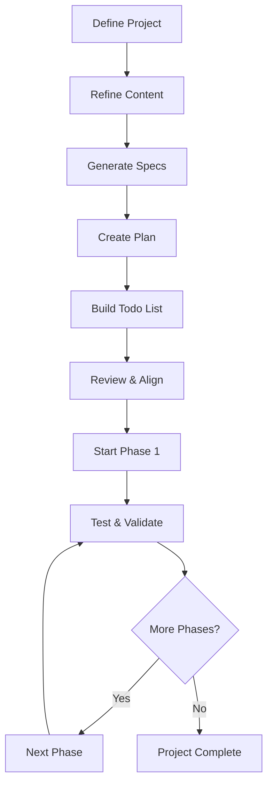

# Spec-Driven Development: A simple How-to Guide

*A systematic approach to building software projects with clarity and structure*

---

## 🎯 Overview

Spec-driven development is a methodology that emphasizes thorough planning and documentation before writing code. This approach helps ensure projects are well-defined, properly scoped, and efficiently executed.

## 📋 The Complete Process

### Phase 1: Project Definition
**Goal:** Create a comprehensive project outline

Start by answering these key questions:
- **What are you building?** - Clear description of the product/feature
- **Who is it for?** - Target audience and users  
- **What's the main idea?** - Core concept and value proposition
- **Which technologies do you prefer?** - Tech stack preferences
- **Will it have a web UI?** - Interface requirements
- **Do you need integrations?** - External services (Azure, APIs, etc.)

*You can use speech-to-text tools like Twhisper to efficiently capture your thoughts and project requirements.*

> 💡 **Pro Tip:** The more detailed your initial description, the better your final specifications will be.

### Phase 2: Content Refinement
**Goal:** Polish and clarify your project description

1. **Initial Review** - Discuss your outline with team members
2. **AI Enhancement** (Optional) - Use ChatGPT or similar AI to:
   - "Make it pretty" 
   - Clarify unclear sections
   - Improve presentation and structure

*This step helps present information more effectively and catches potential gaps.*

### Phase 3: Specification Generation
**Goal:** Transform your project outline into formal specifications

Using Claude Code environment with custom commands:

#### Command 1: `/task:new`
```bash
/task:new
# Paste your refined project content
```
**Output:** 
- Creates `docs/` folder structure
- Generates `1_specs/` subfolder  
- Creates detailed specification file with auto-generated name

#### Command 2: `/task:plan`
```bash
/task:plan [specification-file-name]
```
**Output:** 
- Generates comprehensive project plan
- Review recommended (can be skimmed or studied in detail)

#### Command 3: `/task:todos`
```bash
/task:todos [planning-file-name]
```

**Output:**
- Creates detailed to-do list (markdown format)
- Organized into phases (Phase 1, Phase 2, etc.)
- ⏱️ *Allow ~10 minutes for larger projects*

> These commands are defined in `CLAUDE/USER/commands/task:*`

### Phase 4: Review and Alignment
**Goal:** Ensure accuracy and consistency across all documents

1. **Review Process**
   - Verify todo list completeness
   - Identify areas needing adjustment

2. **Synchronization**
   - Update specifications if needed
   - Modify todo list accordingly
   - Keep all related files aligned
   - Use Claude Code for synchronization of the 3 files

### Phase 5: Implementation
**Goal:** Execute the project systematically

1. **Start Development**
   Begin with Phase 1 tasks by telling Claude Code to start with phase 1

2. **Testing Strategy**
   - Functional tests (recommended to keep)
   - Non-functional tests (optional - personal preference)
   - Review testing requirements after each phase completion

3. **Progress Tracking**
   - Complete phases sequentially
   - Test after each phase when possible
   - Update documentation as needed

---

## 🔄 Workflow Summary



## 🛠️ Tools Used

- **Twhisper** - Initial discussion and refinement
- **ChatGPT/AI** - Content polishing (optional)
- **Claude Code** - Specification generation and project management
- **Custom Commands** - `/task:new`, `/task:plan`, `/task:todos`

---

## 💭 Why Spec-Driven Development?

Having a detailed specification, followed by a clear implementation plan and a todo list, provides clarity for both AI and developers. This approach ensures everyone understands what needs to be built and how to build it, significantly reducing the risk of hallucination or misinterpretation. While creating a thorough plan does take some time, it prevents the pitfalls of one-shot prompting, which often lacks clear guidance, goals, and purpose. Without a solid plan, AI may struggle to understand the intended outcome.

Files like Claude.md or Cursor rules files can offer some structure, but they are weak substitutes for comprehensive feature specifications and implementation plans. Relying solely on these files increases the likelihood of confusion and hallucination. In contrast, specification-driven development establishes clear agreements and contracts about the code, allowing the team to focus on what's important and how to implement it. Nothing is more effective for clarity and alignment than a well-defined specification and plan.

---

*Questions? Feel free to adapt this process to fit your team's specific needs and preferences.*